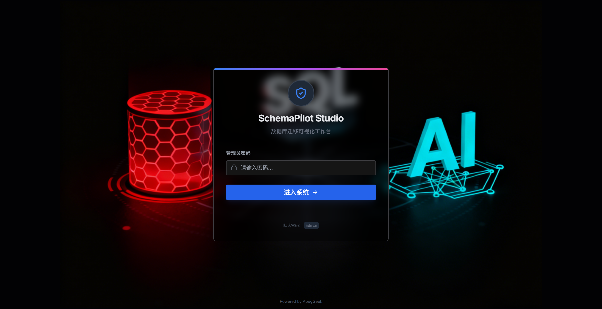
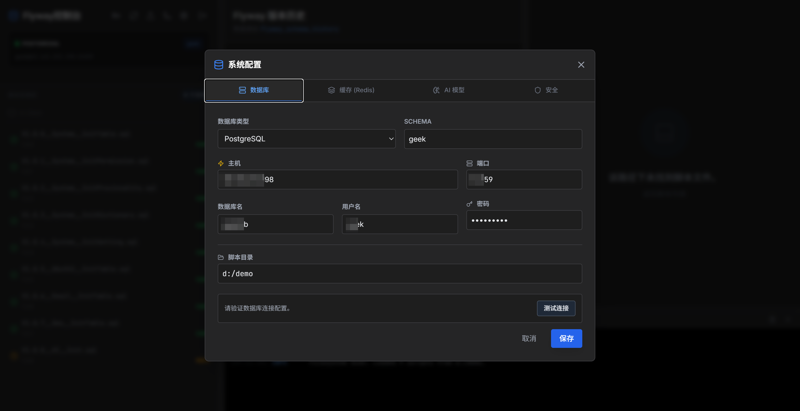
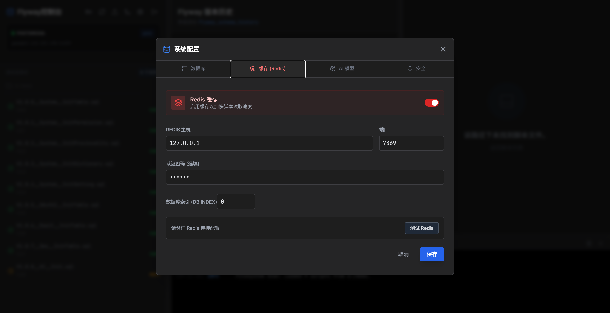
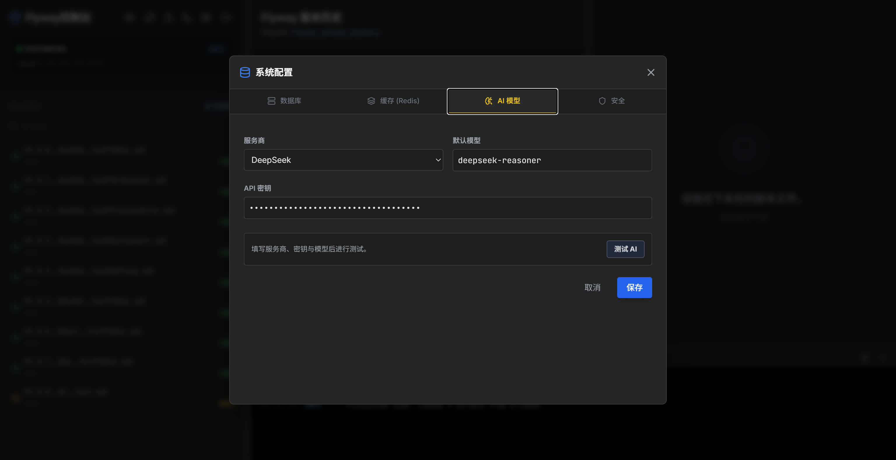
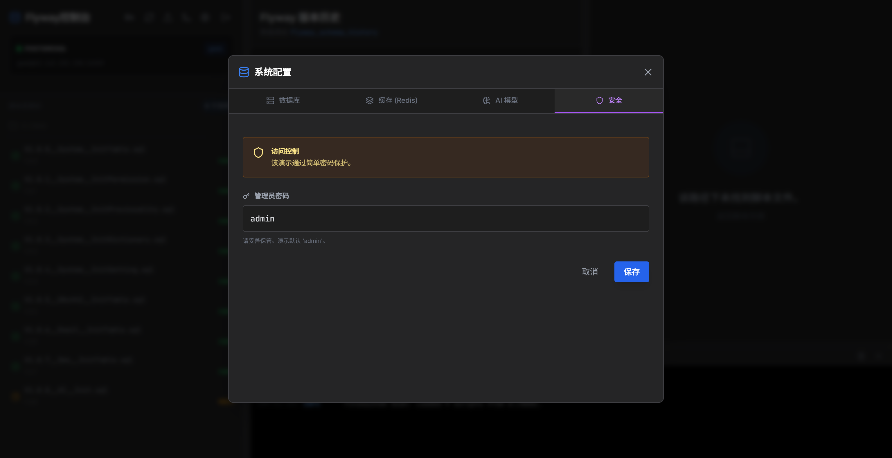
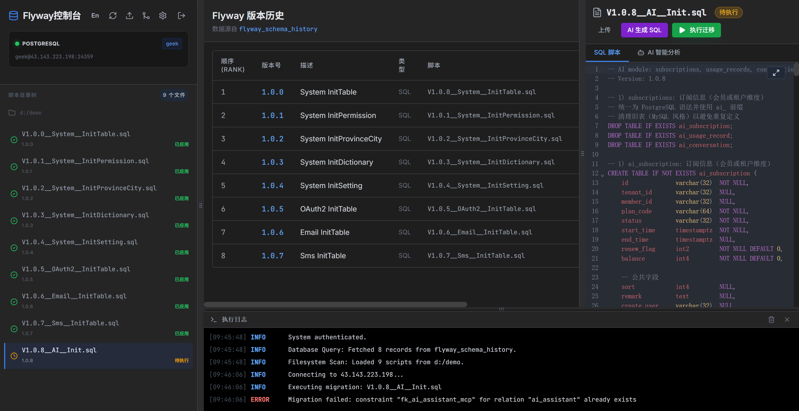
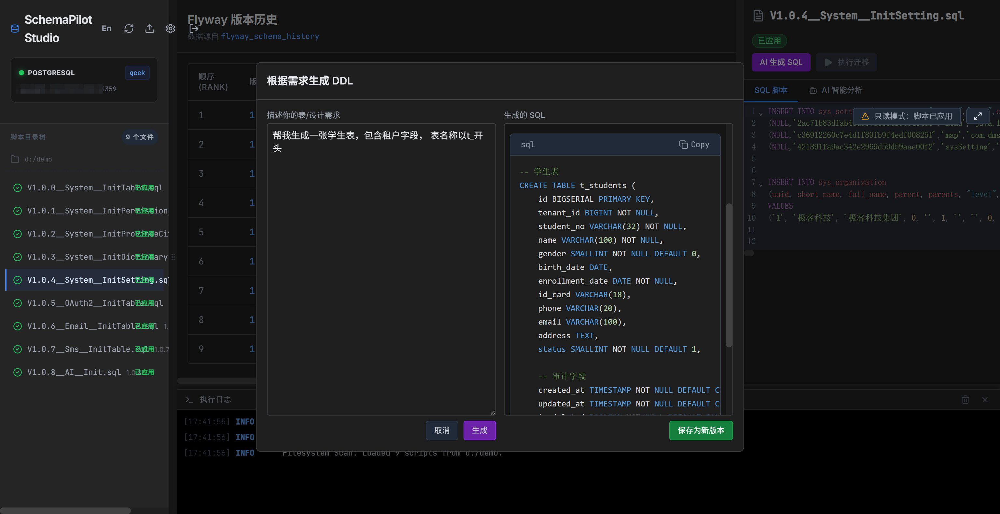
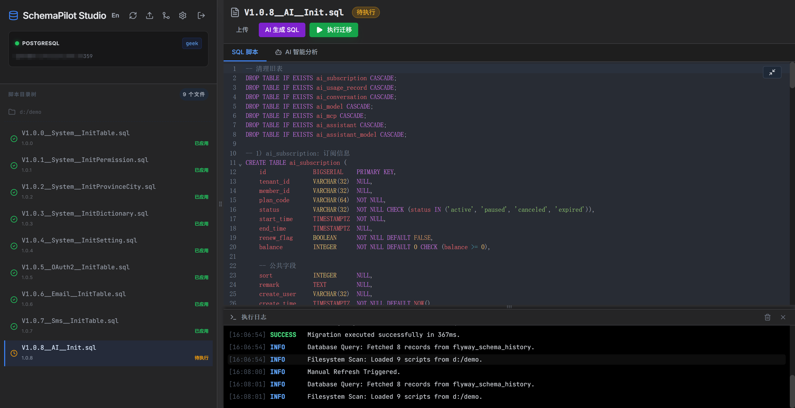

<div align="center">
  <h1>SchemaPilot Studio · 数据库迁移可视化工作台</h1>
  <p>Visual, Operable, and Insightful Flyway migrations</p>

  <p>
    
    
    
    
    
    
  </p>
  <p><strong>Flyway • Database Migration • Schema History • SQL</strong></p>
</div>

---

> Language / 语言：[English](./README.en.md) · [中文](./README.md)

## 为什么做
- 数据库迁移是交付关键路径，但脚本与历史常常分散、不可视、不可操作。
- SchemaPilot Studio 把“脚本树 / 历史记录 / SQL 编辑与执行 / 运行日志”整合在一个可视化工作台中，提升迁移效率、降低出错率。
- 目标：让 Flyway 迁移像操作 IDE 一样顺手，脚本管理“可见、可改、可控”。

## 核心优势
- **三栏工作台**：左侧脚本树、中栏历史表、右侧 SQL 编辑器，底部统一运行日志。
- **真连接测试**：支持 MySQL/PostgreSQL 的真实连接校验，错误即报错。
- **文件系统直连**：读取并上传 `.sql` 到你配置的目录（如 `D:\demo`），无中间层。
- **状态映射**：脚本与 `flyway_schema_history` 自动比对，标记“已应用/失败/待执行”。
- **语法高亮与编辑**：SQL 高亮、行号、可滚动；仅“待执行”脚本可编辑与保存。
- **即时刷新**：配置变更后自动拉取最新脚本与历史，展示实时数据。
- **免密刷新**：登录后 30 分钟免登录，刷新不丢状态。
- **AI 能力**：内置“AI 分析 SQL”“AI 生成 SQL”，支持 Gemini/DeepSeek，流式输出与 SQL 高亮展示。

## 功能特性
- 脚本树
  - 递归读取配置目录，解析 `V<版本>__<描述>.sql` 文件结构
  - 上传新脚本至配置目录；执行状态图标与文案支持中英
- 历史记录
  - 原始数据来自 `flyway_schema_history`，包含脚本名、耗时、执行状态
  - 列表数据不缓存，每次刷新即查询最新
- SQL 编辑器
  - CodeMirror 高亮；仅“待执行”允许编辑与保存
  - 全屏查看，长脚本更易读；顶部工具栏两行布局，长文件名不挤压按钮
- 运行日志
  - 统一置底，横跨中栏+右栏，不遮挡脚本树；支持打开/隐藏

### 后端接口（开发模式）
- `POST /api/ai/analyze/stream`：AI 分析流式输出（`vite.config.ts:689` 起）
- `POST /api/ai/generate-sql/stream`：AI 生成 SQL 流式输出（`vite.config.ts:856` 起）

## 快速开始
### 环境要求
- Node.js 18+
- 推荐包管理器：pnpm

### 安装与启动
```bash
pnpm install
pnpm run dev
```
访问：`http://localhost:3000`

### 构建与预览
```bash
pnpm run build
pnpm run preview
```

## 使用说明
- 配置
  - 打开右上角设置，填写数据库信息与脚本目录（如 `D:\demo`）
  - “测试连接”会进行真实连接与 `SELECT 1` 校验
- 浏览脚本
  - 左侧树显示脚本；点击文件在右侧查看与编辑
  - 上传按钮支持 `.sql` 文件，保存到你配置的目录
- 编辑与保存
  - 仅“待执行”脚本可编辑；内容变更后显示“保存”按钮
  - 保存会写入真实文件系统，并在列表中立即生效
- 变更历史
  - 中栏表格显示 `flyway_schema_history` 最新记录；支持滚动查看

## 截图与布局
- 三栏工作台（左：脚本树｜中：历史表｜右：SQL 编辑器），底部运行日志
- 可拖拽调整列宽，分隔条带有握柄图标与“拖拽以调整宽度”提示

## 功能截图

- **登录**
  
  

  
- **配置向导（数据库与缓存）**
  
  
  
  
  
  
  
  

- **首页**
  
  

- **AI 生成 SQL**
  
  

- **AI 分析 SQL**
  
  

- **全屏模式**
  
  

## 高级能力
- **AI 双引擎与可配置**：支持 `Gemini` 与 `DeepSeek`，自定义 `provider/model/apiKey`，提示词可缓存与复用，分析结果以 Markdown 渲染并支持 SQL 高亮。
- **命名规则自动化**：保存“新版本”自动按 `V<版本>__<描述>.sql` 计算下一版本号，描述自动 `slug` 规范化。
- **仅保存 SQL**：从 AI 输出中提取代码块或基于关键字识别段落，确保写入文件仅为 SQL 内容。
- **预览不撑开页面**：生成/分析面板启用 `min-h-0` 与 `overflow-y-auto`，大段内容内部滚动，页面布局稳定。
- **状态映射与只读保护**：与 `flyway_schema_history` 比对，已应用脚本只读，待执行可编辑并支持保存。
- **Redis 与本地缓存**：脚本与历史按需缓存，AI 全局配置读写接口，提升交互与加载性能。
- **连接与健康检查**：真实数据库连接测试与 Redis Ping 校验，错误即时反馈。
- **多栏与全屏**：多分栏可拖拽，编辑器支持全屏阅读与操作，底部日志可调高。
- **国际化**：中英文切换，界面文本与提示同步适配。
- **生产部署建议**：开发路由便于调试，生产环境可替换为后端服务进行鉴权与审计。

## 部署
- 本项目为前端 SPA 应用，可配合任何静态服务器部署 `dist/`
  - Nginx 示例：
    ```nginx
    server {
      listen 80;
      server_name your-domain;
      root /var/www/schema-pilot/dist;
      location / { try_files $uri /index.html; }
    }
    ```
- 开发服务内置了部分后端路由（文件读取/上传、连接测试），生产环境请按需替换为你自己的后端服务。

## 系统设计：Redis 缓存与键名约定
- 缓存用途：存放 AI 模型配置（服务商、模型名、API Key），便于前端与后端统一读取，避免每次手动填写。
- 键空间（最新结构，扁平键名，无命名空间分隔符）：
  - `schema-pilotaiconfig`：AI 模型配置对象（含 `provider`、`model`、`apiKey`）
  - `schema-pilotdbconfig`：数据库全局配置
  - `schema-pilotsecuritypassword`：应用登录密码
  - `schema-pilotdbhistory`：`flyway_schema_history` 最新快照（用于缓存读取）
- 路由接口：
  - `POST /api/ai/config/save`：保存 AI 配置到 Redis（需已启用 Redis 并正确设置连接信息）
  - `GET /api/ai/config/get`：读取 AI 配置；未设置时返回 `null`
  - `POST /api/ai/analyze`：AI 分析 SQL 脚本，默认优先使用请求体中的 `config.ai`，若缺失则回退到 Redis 中的全局配置
- 说明：
  - 开发模式下，Redis 的连接信息在“设置-缓存 (Redis)”中配置；启用后保存即生效。
  - 为安全起见，生产环境应将 Redis 与 AI Key 的读写代理到后端服务，并做好权限控制与审计。

## 第三方依赖与鸣谢
- 核心理念与规范
  - Flyway — 数据库迁移与 `flyway_schema_history` 约定，推动脚本版本化与可追溯（https://flywaydb.org/）。
- 数据库访问与缓存
  - `mysql2` — Node.js MySQL/MariaDB 客户端（https://github.com/sidorares/node-mysql2）。
  - `pg` — Node.js PostgreSQL 客户端（https://github.com/brianc/node-postgres）。
  - `redis` — Node.js Redis 客户端（https://github.com/redis/node-redis）。
- 前端与构建
  - `React`、`React DOM` — 前端渲染框架（https://react.dev/）。
  - `Vite` — 开发与构建工具（https://vitejs.dev/）。
  - `TypeScript` — 类型系统与开发体验（https://www.typescriptlang.org/）。
- 编辑与渲染
  - `@uiw/react-codemirror`、`@codemirror/lang-sql`、`@codemirror/theme-one-dark` — SQL 编辑器与主题。
  - `react-markdown`、`remark-gfm` — Markdown 渲染与 GFM 支持。
  - `react-syntax-highlighter` — 代码高亮渲染。
  - `lucide-react` — Icon 集合与 UI 视觉辅助。
- AI 能力（可选）
  - `@google/genai` 与 Google Generative Language API — 生成式 AI；DeepSeek API — 推理与流式输出。
- 鸣谢
  - 衷心感谢以上开源项目及维护者的长期投入与贡献；本项目的设计与实现高度受益于开源生态的成熟能力与最佳实践。
  - 以上名称与商标分别归其各自的权利方所有；引用仅用于技术集成与致谢，不构成赞助或背书。
  - 若你正在维护相关项目或有建议与改进，欢迎与我们交流；我们将持续保持兼容、尊重许可证并积极反馈社区。

## License
- 本项目采用“SchemaPilot Studio 社区许可协议（Community License）”。
- 允许学习与研究、个人与组织内部使用（含生产部署）；不允许售卖或有偿分发。
- 如需二次开发并售卖或对外收费，请联系作者获取商业授权：`daijiang@apegeek.com`。
- 详见 [LICENSE](./LICENSE)（中文）与 [LICENSE.en](./LICENSE.en)（English）。

---


## 作者
- 85后全栈工程师，职业生涯献给编程与产品化实践，长期专注高质量交付与工程化能力建设。
- 持续钻研前沿技术：AI 应用与工程、云原生与 DevOps、数据工程与数据库演进；相信技术与体验的统一价值。
- 热爱交友与户外，倡导开放协作与知识共享，愿与同行共建更卓越的数据与应用生态。
- 联系邮箱：`daijiang@apegeek.com`

## 支持项目
- 如果 SchemaPilot Studio 对你有帮助，欢迎 Star、Fork 与分享；也可通过以下方式支持项目：

<div align="center">
  <table>
    <tr>
      <td align="center" style="margin: 10px 0; padding-right: 24px;">
        
      </td>
      <td align="center" style="margin: 10px 0; padding-left: 24px;">
        
      </td>
    </tr>
  </table>
  <p>您的支持将用于：完善功能、撰写文档与示例、维护社区与路线图。</p>
</div>
